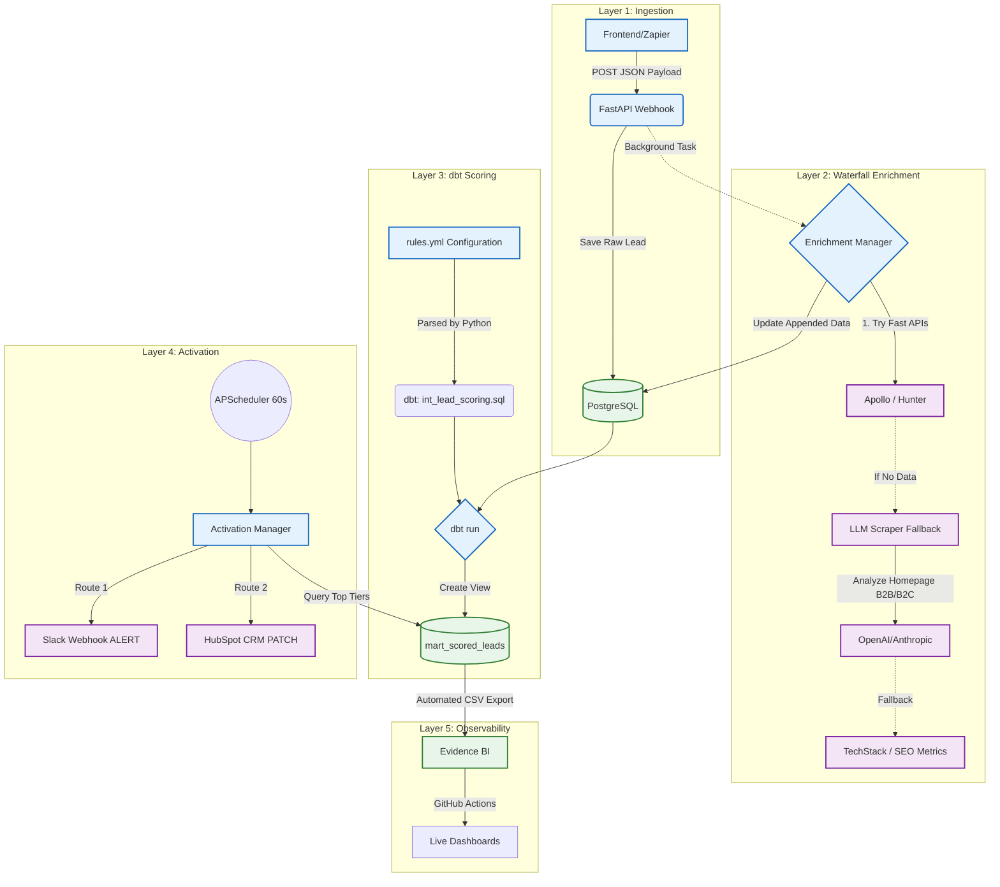

<div align="center">
  
  <h1>LeadGenius</h1>
  <p><strong>The Open-Source, Self-Hosted B2B Lead Scoring & Routing Engine</strong></p>
</div>

<p align="center">
  
  
  
  
  
</p>

---

## Live RevOps Dashboard

The analytics artifacts are automatically built via CI/CD and hosted on GitHub Pages:
**[View Live Evidence BI Dashboard](https://astoriel.github.io/LeadGenius/)**

## The Problem

If you operate a B2B SaaS, your landing pages frequently receive hundreds of sign-ups a day. A small percentage are enterprise opportunities, but the majority are students, personal emails, or B2C traffic.

Enterprise Revenue Operations (RevOps) teams typically rely on tools like Clearbit Reveal, MadKudu, or ZoomInfo to enrich emails, score them, and route actionable leads to Sales. 

The primary issue is that these tools often cost over $20,000 annually and operate as "black boxes" where scoring criteria are opaque.

**LeadGenius** offers a flexible, transparent, open-source alternative without the monthly SaaS overhead.

---

## Architecture

LeadGenius solves B2B data routing across four modular layers: Ingestion, Waterfall Enrichment, Rules-as-Code Scoring, and Reverse ETL.



## Mock Mode Operations

To facilitate evaluation without requiring active API keys for Apollo, Hunter, or LLMs, this repository features a robust Mock Mode Generator.

1. Initialize the cluster with `TEST_MODE="true"` in your `.env` file.
2. The FastAPI Server spins up a background data seeder automatically.
3. It posts 20 highly-realistic mock leads (e.g., Stripe, Vercel, Anthropic) directly into the webhook.
4. The `EnrichmentManager` intercepts these domains and injects standard firmographics, preserving API quotas.
5. The downstream dbt pipeline parses your `rules.yml` file, generates the necessary SQL models, and applies scoring tiers (`Hot`, `Warm`, `Cold`), creating a fully functional dataset.

This procedure runs passively during GitHub Actions CI/CD to power the public-facing [Evidence RevOps Dashboard](https://astoriel.github.io/LeadGenius/).

## CRM Integrations

LeadGenius is built for direct activation into existing CRM and alerting spaces:

- **HubSpot**: Utilizes a native `HubSpotDestination` module. It searches the HubSpot Contacts API by email and executes a `PATCH` request to update custom properties.
- **Slack**: Configurable webhooks to send immediate notifications to a designated channel.
- **Extendable Setup**: The modular `ActivationManager` allows for simple integration via small Python classes (e.g., Salesforce, Pipedrive).

## Transparent YAML Scoring

Define your criteria using a straightforward YAML structure (`rules.yml`). LeadGenius automatically transpiles this into SQL models.

```yaml
scoring_rules:
  - description: "Sales or Exec gets +30"
    sql_condition: "lower(job_title) like '%ceo%' or lower(job_title) like '%vp%'"
    points: 30
  - description: "Confirmed B2B"
    sql_condition: "is_b2b_from_llm = true"
    points: 20
```

## Quick Start

### Prerequisites
- Docker & Docker Compose
- Python 3.11+

### Local Environment Initialization

```bash
# 1. Clone the repository
git clone https://github.com/Astoriel/LeadGenius.git
cd LeadGenius

# 2. Duplicate and configure environment (Mock environment enabled dynamically by default)
cp .env.example .env

# 3. Spin up the cluster
docker-compose up -d --build
```

Monitor the application terminal logs (`docker-compose logs -f api`) to observe the execution of the Waterfall Enrichment pipeline, periodic `dbt run` calls, and corresponding lead routing behavior.
