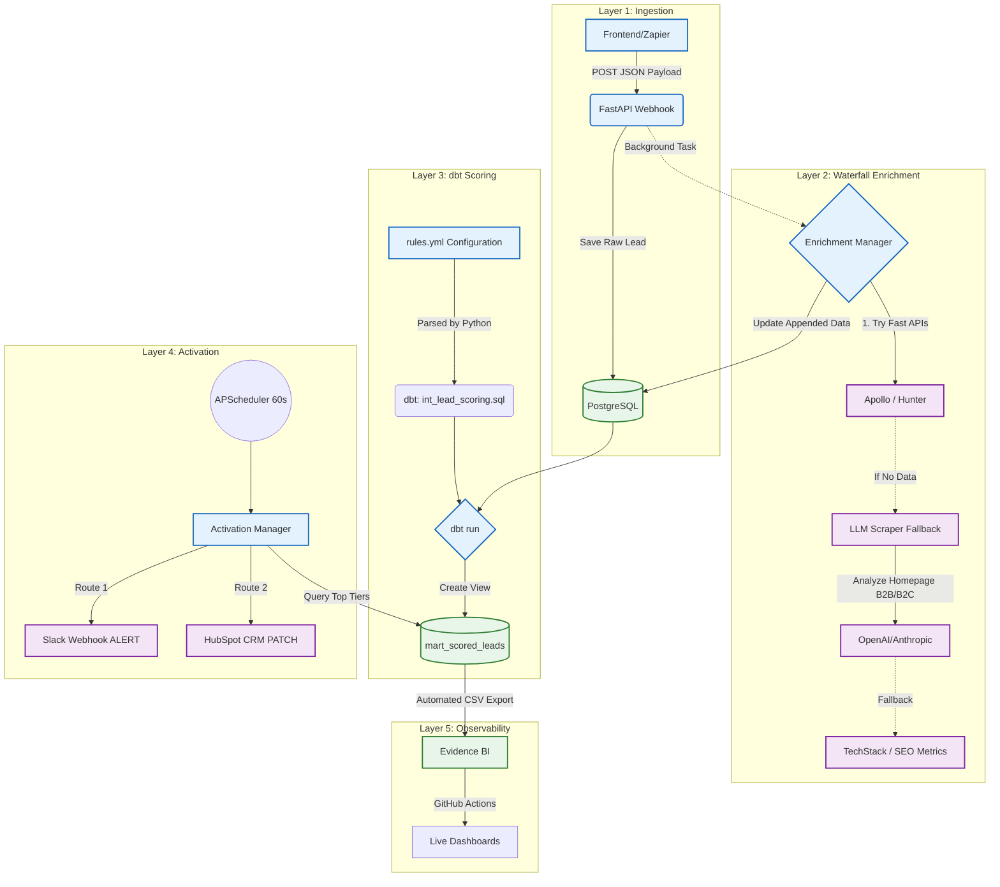

<h1 align="center">
  <br>
  🚀 LeadGenius
  <br>
</h1>

<h4 align="center">The Open-Source, Self-Hosted B2B Lead Scoring & Routing Engine</h4>

<p align="center">
  
  
  
  
  
</p>

<p align="center">
  <a href="#the-problem-why-leadgenius">The Problem</a> •
  <a href="#how-it-works-architecture">Architecture</a> •
  <a href="#live-dashboard--mock-mode">Live Dashboard & Mock Mode</a> •
  <a href="#crm-integrations">CRM Integrations</a> •
  <a href="#quick-start">Quick Start</a>
</p>

---

## 📈 View Live RevOps Dashboard

The analytics artifacts are automatically built via CI/CD and hosted on GitHub Pages:
👉 **[Live Evidence BI Dashboard](https://astoriel.github.io/LeadGenius/)** 👈

## The Problem: Why LeadGenius?

If you run a B2B SaaS, your landing pages get hit with hundreds of sign-ups a day. A few are enterprise whales, but the majority are students, personal emails, or B2C noise.

Enterprise Revenue Operations (RevOps) teams buy tools like **Clearbit Reveal**, **MadKudu**, or **ZoomInfo** to enrich these emails, score them, and route the good ones to Sales. 

**The catch?** These tools cost upwards of **$20,000/year** and often operate as complete "black boxes" (nobody knows exactly *why* a lead got 90 points).

**LeadGenius** offers a transparent, $0/month open-source alternative.

---

## How it Works: Architecture

LeadGenius solves B2B data routing across 4 modular layers: Ingestion, Waterfall Enrichment, Rules-as-Code Scoring, and Reverse ETL.



## Live Dashboard & Mock Mode

To make it easy to evaluate and test this project without needing active API keys for Apollo/Hunter/LLMs, this repository includes a robust **Mock Mode Generator**.

1. Start the cluster with `TEST_MODE="true"` in your `.env` file.
2. The FastAPI Server will automatically spin up a background data seeder.
3. It will push 20 highly-realistic mock leads (e.g., Stripe, Vercel, Anthropic) into the webhook.
4. The `EnrichmentManager` intercepts these domains and injects rich deterministic mock firmographics (Employee counts, Job Titles, Industry).
5. The downstream dbt pipeline parses your `rules.yml` file, generates the SQL models, and assigns beautiful `Hot`/`Warm`/`Cold` tiers to your mock leads, producing a portfolio-ready dataset.

All of this happens invisibly during GitHub Actions CI/CD to power the public-facing [Evidence RevOps Dashboard](https://astoriel.github.io/LeadGenius/).

## CRM Integrations

LeadGenius doesn't just alert you; it actively patches your existing workspace:

*   **HubSpot**: Includes a native `HubSpotDestination` module. It searches the HubSpot Contacts API by email and performs a `PATCH` request to update custom properties (`leadgenius_score`, `leadgenius_tier`).
*   **Slack**: Real-time "Hot Lead" alerts in a dedicated channel.
*   **[Extendable]**: The modular `ActivationManager` makes writing a new Salesforce or Pipedrive integration a 10-line python class.

## Transparent YAML Scoring

Define what matters to you in plain English (`rules.yml`). LeadGenius dynamically generates the SQL.

```yaml
scoring_rules:
  - description: "Sales or Exec gets +30"
    sql_condition: "lower(job_title) like '%ceo%' or lower(job_title) like '%vp%'"
    points: 30
  - description: "Confirmed B2B"
    sql_condition: "is_b2b_from_llm = true"
    points: 20
```

## Quick Start

### Prerequisites
*   Docker & Docker Compose
*   Python 3.11+

### Local Setup

```bash
# 1. Clone the repo
git clone https://github.com/Astoriel/LeadGenius.git
cd LeadGenius

# 2. Configure environment (Mock data is enabled by default in the example!)
cp .env.example .env

# 3. Spin up the cluster (Postgres + FastAPI + CRON Scheduler + Mock Seeder)
docker-compose up -d --build
```

Watch the terminal (`docker-compose logs -f api`) to see the engine execute the Waterfall, trigger `dbt run`, and route the lead!
